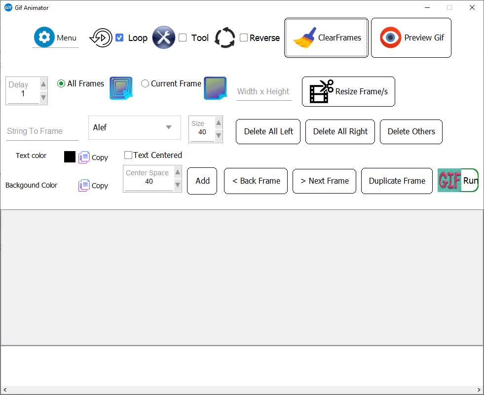
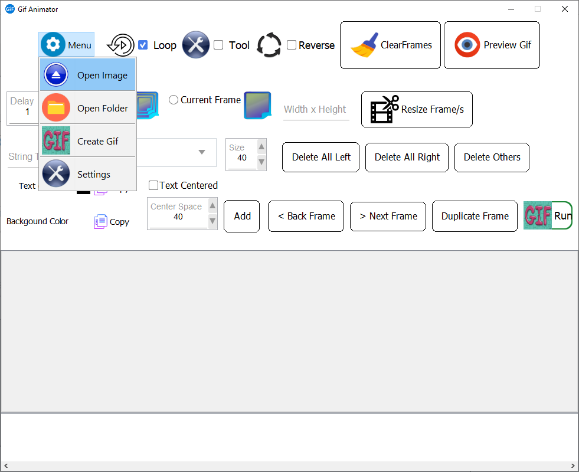

# GIFted

## GIFted is a simple animated GIF maker written in Java.

## Works in Windows and Linux

## You can open and save or drag and drop images, change the order of frames, and set delay times.

## You can also decompose GIF images into their individual frames and make changes to them easily.

## This program uses gifsicle

### Linux: sudo apt install gifsicle

### Windows: Download the files with the .exe extension of this project

### You can move the files to the C:\Windows\System32 folder

### and to the C:\Windows\SysWOW64 folder for 64-bit versions

